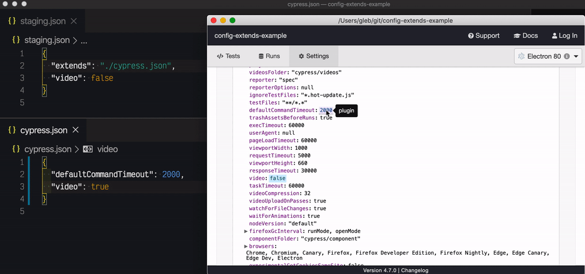

# config-extends-example
> Example Cypress project with config file that extends another config file

See [cypress/plugins/index.js](cypress/plugins/index.js) file and how it loads [staging.json](staging.json) which extends [cypress.json](cypress.json) file.

```
npx cypress open --config-file staging.json
```


